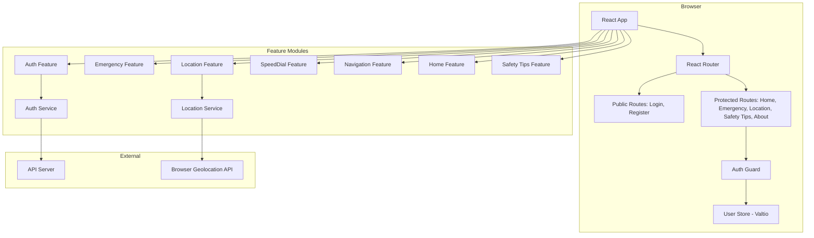
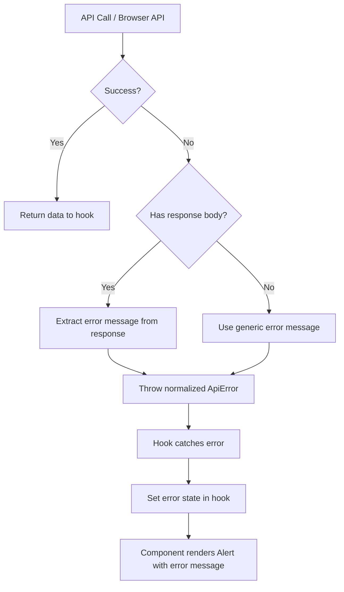

# Design Document: Women Safety Awareness

## Overview

The Women Safety Awareness application is a React + TypeScript single-page application providing safety resources, emergency contacts, live location sharing, and speed dial functionality exclusively for authenticated women users. The application follows a feature-based architecture with clear separation between UI components, business logic (custom hooks), and service layers. Authentication is handled via API calls with a hardcoded bearer token stored in `.env`. Gender-based access control restricts registration to women users only.

### Key Design Decisions

1. **Feature-based folder structure** — Each domain (auth, emergency, location, speed-dial, safety-tips, home) is a self-contained feature module with its own components, hooks, services, and tests.
2. **Valtio for global auth state** — Lightweight proxy-based state for user session management, avoiding prop drilling across route guards and components.
3. **Zod + React Hook Form** — Schema-first validation with type inference keeps form logic out of components.
4. **Axios instance with request interceptor** — Centralized API client that attaches the hardcoded token from `process.env.REACT_APP_AUTH_TOKEN` to every request header.
5. **Mobile-first responsive design** — Tailwind CSS utility classes with breakpoint-based layout shifts (hamburger menu below 768px, responsive grid layouts).
6. **tel: protocol for calls** — Browser-native phone dialing for emergency contacts; no third-party telephony SDK needed.
7. **Browser Geolocation API** — No third-party location SDK; handles permission states gracefully with clear error messages.

## Architecture



### Data Flow

```
User Action → Component → Custom Hook → Service Layer → Axios Client → API
                                                                        ↓
UI Re-render ← Hook State Update ← Service Response ← Axios Response ←
```

### Route Structure

| Path | Component | Protected |
|------|-----------|-----------|
| `/login` | LoginPage | No |
| `/register` | RegisterPage | No |
| `/` | HomePage | Yes |
| `/emergency-contacts` | EmergencyContactsPage | Yes |
| `/live-location` | LiveLocationPage | Yes |
| `/safety-tips` | SafetyTipsPage | Yes |
| `/about` | AboutPage | Yes |

## Components and Interfaces

### Folder Structure

```
src/
├── features/
│   ├── auth/
│   │   ├── components/
│   │   │   ├── LoginForm.tsx
│   │   │   ├── RegisterForm.tsx
│   │   │   └── AuthGuard.tsx
│   │   ├── hooks/
│   │   │   ├── useLogin.ts
│   │   │   └── useRegister.ts
│   │   ├── services/
│   │   │   └── auth.service.ts
│   │   ├── schemas/
│   │   │   ├── login.schema.ts
│   │   │   └── register.schema.ts
│   │   └── __tests__/
│   │       ├── LoginForm.test.tsx
│   │       ├── RegisterForm.test.tsx
│   │       ├── AuthGuard.test.tsx
│   │       ├── auth.service.test.ts
│   │       └── auth.properties.test.ts
│   ├── emergency-contacts/
│   │   ├── components/
│   │   │   ├── EmergencyContactsPage.tsx
│   │   │   └── ContactCard.tsx
│   │   ├── data/
│   │   │   └── contacts.ts
│   │   └── __tests__/
│   │       ├── EmergencyContactsPage.test.tsx
│   │       └── contacts.properties.test.ts
│   ├── location/
│   │   ├── components/
│   │   │   └── LiveLocationPage.tsx
│   │   ├── hooks/
│   │   │   └── useGeolocation.ts
│   │   ├── services/
│   │   │   └── location.service.ts
│   │   └── __tests__/
│   │       ├── LiveLocationPage.test.tsx
│   │       ├── useGeolocation.test.ts
│   │       └── location.properties.test.ts
│   ├── speed-dial/
│   │   ├── components/
│   │   │   └── SpeedDial.tsx
│   │   ├── data/
│   │   │   └── speed-dial-contacts.ts
│   │   └── __tests__/
│   │       ├── SpeedDial.test.tsx
│   │       └── speedDial.properties.test.ts
│   ├── navigation/
│   │   ├── components/
│   │   │   └── NavigationMenu.tsx
│   │   └── __tests__/
│   │       ├── NavigationMenu.test.tsx
│   │       └── navigation.properties.test.ts
│   ├── home/
│   │   ├── components/
│   │   │   └── HomePage.tsx
│   │   └── __tests__/
│   │       └── HomePage.test.tsx
│   └── safety-tips/
│       ├── components/
│       │   ├── SafetyTipsPage.tsx
│       │   └── TipCard.tsx
│       ├── data/
│       │   └── tips.ts
│       └── __tests__/
│           ├── SafetyTipsPage.test.tsx
│           └── tips.properties.test.ts
├── services/
│   └── api-client.ts
├── store/
│   └── user.store.ts
├── types/
│   ├── api.types.ts
│   ├── auth.types.ts
│   └── location.types.ts
├── routes/
│   └── AppRoutes.tsx
├── components/
│   └── ui/
│       ├── Button.tsx
│       ├── Input.tsx
│       ├── Card.tsx
│       └── Alert.tsx
└── styles/
    └── theme.ts
```

### Key Interfaces

```typescript
// types/api.types.ts
export interface ApiResponse<T> {
  success: boolean;
  data: T;
  message?: string;
}

export interface ApiError {
  success: false;
  message: string;
  errors?: Record<string, string[]>;
}

// types/auth.types.ts
export type Gender = 'Female' | 'Male' | 'Other';

export interface User {
  id: string;
  name: string;
  email: string;
  gender: Gender;
}

export interface UserSession {
  user: User;
  token: string;
  isAuthenticated: boolean;
}

export interface LoginRequest {
  email: string;
  password: string;
}

export interface LoginResponse {
  user: User;
  token: string;
}

export interface RegisterRequest {
  name: string;
  email: string;
  password: string;
  confirmPassword: string;
  gender: Gender;
}

export interface RegisterResponse {
  message: string;
}

// types/location.types.ts
export interface GeoPosition {
  latitude: number;
  longitude: number;
  timestamp: number;
}

export type LocationPermissionState = 'idle' | 'requesting' | 'granted' | 'denied' | 'unsupported';

export interface LocationState {
  position: GeoPosition | null;
  error: string | null;
  isSharing: boolean;
  status: LocationPermissionState;
}
```

### Component Interfaces

```typescript
// features/auth/components/AuthGuard.tsx
interface AuthGuardProps {
  children: React.ReactNode;
}

// features/speed-dial/components/SpeedDial.tsx
interface SpeedDialAction {
  id: string;
  label: string;
  phoneNumber: string;
  icon: string;
}

interface SpeedDialProps {
  actions: SpeedDialAction[];
}

// features/emergency-contacts/components/ContactCard.tsx
interface EmergencyContact {
  id: string;
  name: string;
  phoneNumber: string;
  description: string;
  icon: string;
}

interface ContactCardProps {
  contact: EmergencyContact;
}

// features/safety-tips/data/tips.ts
interface SafetyTip {
  id: string;
  title: string;
  description: string;
  icon: string;
}

interface SafetyCategory {
  id: string;
  name: string;
  tips: SafetyTip[];
}

// features/navigation/components/NavigationMenu.tsx
interface NavLink {
  path: string;
  label: string;
}

// components/ui/Button.tsx
interface ButtonProps {
  variant: 'primary' | 'secondary' | 'danger' | 'ghost';
  size: 'sm' | 'md' | 'lg';
  isLoading?: boolean;
  disabled?: boolean;
  onClick?: () => void;
  children: React.ReactNode;
  ariaLabel?: string;
  type?: 'button' | 'submit' | 'reset';
}

// components/ui/Input.tsx
interface InputProps {
  label: string;
  name: string;
  type: 'text' | 'email' | 'password' | 'tel' | 'select';
  error?: string;
  placeholder?: string;
  options?: Array<{ value: string; label: string }>;
}

// components/ui/Alert.tsx
interface AlertProps {
  variant: 'error' | 'success' | 'warning' | 'info';
  message: string;
}
```

### Service Layer

```typescript
// services/api-client.ts
// Axios instance configured with:
// - baseURL from REACT_APP_API_BASE_URL
// - Authorization header: Bearer ${REACT_APP_AUTH_TOKEN} via request interceptor
// - Content-Type: application/json
// - Response interceptor for error normalization

// features/auth/services/auth.service.ts
export const authService = {
  login(credentials: LoginRequest): Promise<ApiResponse<LoginResponse>>;
  register(data: RegisterRequest): Promise<ApiResponse<RegisterResponse>>;
};

// features/location/services/location.service.ts
export const locationService = {
  getCurrentPosition(): Promise<GeoPosition>;
  isGeolocationSupported(): boolean;
  generateShareableLink(position: GeoPosition): string;
};
```

## Data Models

### Valtio User Store

```typescript
// store/user.store.ts
import { proxy } from 'valtio';
import { UserSession } from '../types/auth.types';

interface UserState {
  session: UserSession | null;
  isLoading: boolean;
}

export const userStore = proxy<UserState>({
  session: null,
  isLoading: false,
});

export const userActions = {
  setSession: (session: UserSession) => {
    userStore.session = session;
  },
  clearSession: () => {
    userStore.session = null;
  },
  setLoading: (loading: boolean) => {
    userStore.isLoading = loading;
  },
};
```

### Zod Validation Schemas

```typescript
// features/auth/schemas/register.schema.ts
import { z } from 'zod';

export const registerSchema = z.object({
  name: z.string().min(2, 'Name must be at least 2 characters'),
  email: z.string().email('Invalid email format'),
  password: z.string().min(8, 'Password must be at least 8 characters'),
  confirmPassword: z.string().min(1, 'Confirm password is required'),
  gender: z.enum(['Female', 'Male', 'Other']),
}).refine((data) => data.password === data.confirmPassword, {
  message: 'Passwords do not match',
  path: ['confirmPassword'],
}).refine((data) => data.gender === 'Female', {
  message: 'This application is available to women only',
  path: ['gender'],
});

export type RegisterFormData = z.infer<typeof registerSchema>;

// features/auth/schemas/login.schema.ts
import { z } from 'zod';

export const loginSchema = z.object({
  email: z.string().min(1, 'Email is required').email('Invalid email format'),
  password: z.string().min(1, 'Password is required'),
});

export type LoginFormData = z.infer<typeof loginSchema>;
```

### API Client Configuration

```typescript
// services/api-client.ts
import axios from 'axios';

const apiClient = axios.create({
  baseURL: process.env.REACT_APP_API_BASE_URL || 'http://localhost:3001/api',
  headers: {
    'Content-Type': 'application/json',
  },
});

apiClient.interceptors.request.use((config) => {
  const token = process.env.REACT_APP_AUTH_TOKEN;
  if (token) {
    config.headers.Authorization = `Bearer ${token}`;
  }
  return config;
});

export default apiClient;
```

### Environment Variables

```
REACT_APP_API_BASE_URL=http://localhost:3001/api
REACT_APP_AUTH_TOKEN=hardcoded-dummy-token-for-dev
```

### Emergency Contacts Data

```typescript
// features/emergency-contacts/data/contacts.ts
export const EMERGENCY_CONTACTS: EmergencyContact[] = [
  { id: '1', name: 'Police', phoneNumber: '100', description: 'Emergency police helpline', icon: 'shield' },
  { id: '2', name: 'Women Helpline', phoneNumber: '1091', description: 'National Commission for Women', icon: 'phone' },
  { id: '3', name: 'Ambulance', phoneNumber: '102', description: 'Medical emergency services', icon: 'ambulance' },
  { id: '4', name: 'Fire Brigade', phoneNumber: '101', description: 'Fire emergency services', icon: 'fire' },
];
```

### Speed Dial Actions Data

```typescript
// features/speed-dial/data/speed-dial-contacts.ts
export const SPEED_DIAL_ACTIONS: SpeedDialAction[] = [
  { id: '1', label: 'Police', phoneNumber: '100', icon: 'shield' },
  { id: '2', label: 'Women Helpline', phoneNumber: '1091', icon: 'phone' },
  { id: '3', label: 'Custom Emergency', phoneNumber: '', icon: 'star' },
];
```

### Safety Tips Data

```typescript
// features/safety-tips/data/tips.ts
export const SAFETY_CATEGORIES: SafetyCategory[] = [
  {
    id: '1',
    name: 'Travel Safety',
    tips: [
      { id: 't1', title: 'Share your itinerary', description: 'Always share your travel plans with a trusted contact.', icon: 'map' },
      // ... more tips
    ],
  },
  {
    id: '2',
    name: 'Workplace Safety',
    tips: [
      { id: 'w1', title: 'Know your rights', description: 'Understand workplace harassment policies and reporting procedures.', icon: 'briefcase' },
      // ... more tips
    ],
  },
  {
    id: '3',
    name: 'Online Safety',
    tips: [
      { id: 'o1', title: 'Protect personal information', description: 'Never share personal details with strangers online.', icon: 'lock' },
      // ... more tips
    ],
  },
];
```

### API Endpoints

| Method | Endpoint | Request Body | Response |
|--------|----------|-------------|----------|
| POST | /api/auth/register | RegisterRequest | ApiResponse\<RegisterResponse\> |
| POST | /api/auth/login | LoginRequest | ApiResponse\<LoginResponse\> |


## Correctness Properties

*A property is a characteristic or behavior that should hold true across all valid executions of a system — essentially, a formal statement about what the system should do. Properties serve as the bridge between human-readable specifications and machine-verifiable correctness guarantees.*

### Property 1: Active Navigation State

*For any* valid application route, the Navigation_Menu component shall apply active styling exclusively to the link corresponding to that route, and no other links shall have active styling.

**Validates: Requirements 1.3**

### Property 2: Gender Restriction Rejects Non-Female

*For any* gender value that is not "Female" (including "Male", "Other", or any arbitrary string), the registration validation schema shall reject the input and produce an error message indicating the application is available to women only.

**Validates: Requirements 2.2, 2.3**

### Property 3: Valid Registration Sends Correct POST

*For any* valid registration data (name ≥ 2 chars, valid email, password ≥ 8 chars, matching confirmPassword, gender = "Female"), the Auth_Service shall send a POST request to the registration endpoint with the exact user-provided data as the request body.

**Validates: Requirements 2.4**

### Property 4: Registration Validation Rejects Invalid Input

*For any* string that does not match email format, the email validation shall reject. *For any* password shorter than 8 characters, the password validation shall reject. *For any* pair of non-matching password and confirmPassword strings, the confirmation validation shall reject.

**Validates: Requirements 2.8**

### Property 5: API Error Messages Displayed

*For any* error message string returned by the authentication API (login or registration), the corresponding form component shall render that exact message text visible to the user.

**Validates: Requirements 2.7, 3.6**

### Property 6: Valid Login Stores User Data

*For any* valid User object and token string returned by the login API, after successful login the User_Store shall contain that exact user data and token, and isAuthenticated shall be true.

**Validates: Requirements 3.2, 3.4**

### Property 7: Login Validation Rejects Empty Fields

*For any* empty or whitespace-only string provided as email or password in the login form, the login validation schema shall reject the input and prevent form submission.

**Validates: Requirements 3.7**

### Property 8: Auth Guard Redirects Unauthenticated Users

*For any* protected route path in the application, when the User_Store contains no valid session (session is null), the Auth_Guard shall redirect to the login page.

**Validates: Requirements 4.1**

### Property 9: Auth Guard Allows Authenticated Users

*For any* protected route path in the application, when the User_Store contains a valid user session, the Auth_Guard shall render the protected route content without redirecting.

**Validates: Requirements 4.2**

### Property 10: Phone Contact Rendering with tel: Protocol

*For any* contact object (EmergencyContact or SpeedDialAction) with a non-empty phoneNumber field, the rendered component shall produce an anchor element with href equal to "tel:{phoneNumber}".

**Validates: Requirements 5.2, 5.3, 7.3**

### Property 11: Location Service Returns Geolocation Coordinates

*For any* latitude and longitude pair returned by the browser Geolocation API, the Location_Service shall produce a GeoPosition object containing those exact coordinates and a valid timestamp.

**Validates: Requirements 6.2**

### Property 12: Location Display Shows Coordinates and Timestamp

*For any* valid GeoPosition object (latitude, longitude, timestamp), the LiveLocationPage component shall render the latitude value, longitude value, and a formatted timestamp string in the UI.

**Validates: Requirements 6.3**

### Property 13: Shareable Link Contains Coordinates

*For any* valid GeoPosition with latitude and longitude values, the generated shareable link/text shall contain string representations of both the latitude and longitude values.

**Validates: Requirements 6.6**

### Property 14: Safety Tip Rendering

*For any* SafetyTip object with a title and description, the TipCard component shall render both the title text and description text in its output.

**Validates: Requirements 9.2**

## Error Handling

### Error Handling Strategy by Layer

| Layer | Error Type | Handling |
|-------|-----------|----------|
| Axios Client | Network errors (timeout, no connection) | Normalize to ApiError with generic message |
| Axios Client | HTTP 4xx/5xx | Extract error message from response body |
| Auth Service | API returns `{ success: false, message }` | Throw normalized error with API message |
| Custom Hooks | Service throws | Set error state, clear loading state |
| Components | Hook returns error | Display error in Alert component |
| Location Service | Permission denied | Return specific error message |
| Location Service | Geolocation unsupported | Return specific error message |

### Error Flow



### Specific Error Scenarios

1. **Registration gender restriction** — Client-side Zod validation rejects before API call; instant feedback via field-level error.
2. **Registration API error** (e.g., "Email already exists") — Display API message in form-level Alert.
3. **Login invalid credentials** — Display API message "Invalid email or password" in form-level Alert.
4. **Network timeout/failure** — Display "Unable to connect. Please check your internet connection."
5. **Geolocation denied** — Display "Location permission is required for this feature. Please enable it in your browser settings."
6. **Geolocation unsupported** — Display "Your browser does not support location sharing."
7. **Protected route access (unauthenticated)** — Silent redirect to `/login`.

### Error UI Patterns

- **Form-level errors**: Red Alert component below form title with `role="alert"`
- **Field-level errors**: Red text below the input field with `aria-describedby` linking to the error
- **Page-level errors**: Full-width Alert banner at top of content area
- **All error messages** include `role="alert"` for screen reader announcement

## Testing Strategy

### Testing Framework

- **Jest** — Test runner and assertion library (via react-scripts)
- **React Testing Library** — Component rendering and user interaction simulation
- **@testing-library/user-event** — Realistic user event simulation
- **fast-check** — Property-based testing library for TypeScript

### Testing Approach

**Dual Testing Strategy:**
- **Unit tests (example-based)**: Verify specific scenarios, edge cases, error conditions, and UI rendering
- **Property tests (property-based)**: Verify universal properties across generated inputs using `fast-check`

### Property-Based Test Configuration

- Minimum **100 iterations** per property test
- Each property test must reference its design document property
- Tag format: `Feature: women-safety-awareness, Property {number}: {property_text}`
- Implement each correctness property with a SINGLE property-based test

### Test Organization

Property tests are co-located with unit tests in each feature's `__tests__/` folder with a `.properties.test.ts` suffix.

### Unit Test Coverage Map

| Requirement | Component Under Test | Test Scenarios |
|-------------|---------------------|----------------|
| Req 1 | NavigationMenu | Renders all links, routing works, active state, ARIA labels, responsive hamburger |
| Req 2 | RegisterForm | Renders fields, gender restriction error, validation errors, API success redirect, API error display |
| Req 3 | LoginForm | Renders fields, validation, API success + store update + redirect, API error display |
| Req 4 | AuthGuard | Unauthenticated redirect, authenticated access, logout clears state |
| Req 5 | EmergencyContactsPage | Renders contacts, tel: links, accessibility landmarks |
| Req 6 | LiveLocationPage | Permission granted shows coords, permission denied message, unsupported message, share link generation |
| Req 7 | SpeedDial | FAB renders, expand/collapse, tel: links, keyboard access, ARIA labels |
| Req 8 | HomePage | Hero section, quick-access cards, navigation on card click |
| Req 9 | SafetyTipsPage | Categories render, tip structure (title + description), heading hierarchy |
| Req 10 | All above | Covered by tests in Reqs 1–9 |

### Property Test Coverage Map

| Property | Test File | What It Verifies |
|----------|-----------|------------------|
| Property 1 | navigation.properties.test.ts | Active link matches current route |
| Property 2 | auth.properties.test.ts | Non-Female gender always rejected by schema |
| Property 3 | auth.properties.test.ts | Valid registration data always triggers POST |
| Property 4 | auth.properties.test.ts | Invalid email/password/confirm always rejected |
| Property 5 | auth.properties.test.ts | Any API error message is displayed in UI |
| Property 6 | auth.properties.test.ts | Any user data from API stored correctly in store |
| Property 7 | auth.properties.test.ts | Empty/whitespace fields always rejected |
| Property 8 | auth.properties.test.ts | Null session + any protected route → redirect |
| Property 9 | auth.properties.test.ts | Valid session + any protected route → renders |
| Property 10 | contacts.properties.test.ts, speedDial.properties.test.ts | Any phone number → correct tel: href |
| Property 11 | location.properties.test.ts | Any lat/lng from API → correct GeoPosition |
| Property 12 | location.properties.test.ts | Any GeoPosition → values displayed |
| Property 13 | location.properties.test.ts | Any coordinates → present in shareable link |
| Property 14 | tips.properties.test.ts | Any tip object → title and description rendered |

### Mocking Strategy

| Dependency | Mock Approach |
|-----------|--------------|
| Axios API calls | `jest.mock('../../services/api-client')` — mock at module level |
| Browser Geolocation | `Object.defineProperty(navigator, 'geolocation', ...)` |
| React Router navigation | `MemoryRouter` with initial entries, mock `useNavigate` |
| Valtio store | Import store directly, reset state between tests |
| Environment variables | Set `process.env.REACT_APP_AUTH_TOKEN` in test setup |

### Test Naming Convention

```typescript
describe('ComponentName', () => {
  describe('when [condition]', () => {
    it('should [expected behavior]', () => {
      // Arrange
      // Act
      // Assert
    });
  });
});
```

### Dependencies to Add for Testing

```json
{
  "devDependencies": {
    "fast-check": "^3.x"
  }
}
```
